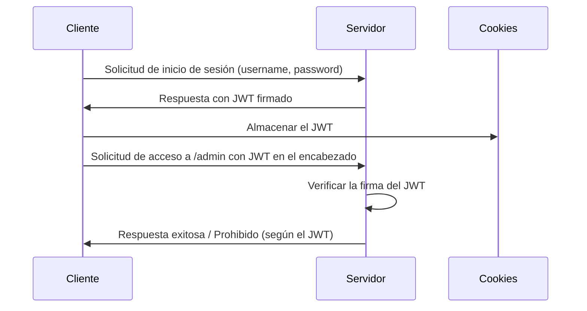

# Componentes de un JWT (JSON Web Token)

## 1. **Header (Encabezado)**

El **header** de un JWT contiene dos partes principales:
- El tipo de token, que generalmente es **JWT**.
- El algoritmo de encriptación utilizado para firmar el token, como **HS256** o **RS256**.

Ejemplo de un header en JSON:

```json
{
  "alg": "HS256",
  "typ": "JWT"
}
```

Este JSON se convierte a una cadena codificada en Base64.

## 2. **Algoritmos de Encriptación**

El algoritmo de encriptación define cómo se firma y verifica la autenticidad del JWT. Los algoritmos más comunes son:
- **HS256**: HMAC con SHA-256 (clave secreta compartida).
- **RS256**: RSA con SHA-256 (utiliza claves públicas y privadas).

El algoritmo **HS256** es más sencillo y rápido, pero se recomienda utilizar **RS256** para mayor seguridad cuando se gestionan claves públicas y privadas.

## 3. **Payload (Cuerpo del Token)**

El **payload** contiene los datos del token. Estos datos son llamados "claims" o "declaraciones", y pueden ser:
- **Public claims** (declaraciones públicas): Información pública como `nombre` o `rol`.
- **Private claims** (declaraciones privadas): Información personalizada según los requerimientos de la aplicación.
- **Registered claims** (declaraciones registradas): Son claims estándares como `iat`, `exp`, `iss`, `sub`, entre otros.

Ejemplo de un payload:

```json
{
  "id": 1,
  "nombre": "admin",
  "rol": "admin",
  "iat": 1516239022
}
```

## 4. **El Elemento `iat`**

**`iat`** significa **Issued At** ("Emitido a las"), e indica la fecha y hora en la que el token fue generado. Este campo es útil para gestionar la validez temporal del token y prevenir problemas de seguridad como el uso de tokens antiguos.

```json
{
  "iat": 1516239022
}
```

Este valor está en **timestamp** Unix, que es la cantidad de segundos desde el 1 de enero de 1970.

## 5. **Signature (Firma)**

La **firma** se utiliza para verificar que el mensaje no ha sido alterado después de su creación. Para generar la firma, se toma el **header**, el **payload**, y una **clave secreta** (o clave privada en el caso de RS256) y se pasa a través del algoritmo especificado.

Fórmula para la firma:

```
HMACSHA256(
  base64UrlEncode(header) + "." + base64UrlEncode(payload),
  claveSecreta
)
```

Esta firma garantiza la integridad y la autenticidad del token.

## 6. **El Código Base64**

El contenido del **header** y del **payload** se codifican utilizando Base64, una técnica de codificación que permite que los datos binarios sean representados como texto ASCII. Esto hace que el token sea más compacto y fácil de transmitir a través de protocolos como HTTP.

Ejemplo de conversión Base64 de un payload:

```bash
echo -n '{"id":1,"nombre":"admin","rol":"admin"}' | base64
```

## 7. **Almacenamiento en `LocalStorage`/`SessionStorage`**

Los JWT suelen almacenarse en el navegador, y hay dos lugares comunes donde pueden ser guardados:
- **`LocalStorage`**: Los datos permanecen incluso después de que el navegador se cierre. Ideal para tokens que deben persistir entre sesiones.
- **`SessionStorage`**: Los datos se eliminan cuando se cierra la pestaña o el navegador. Ideal para tokens temporales.

**Ejemplo de almacenamiento en `LocalStorage`:**

```javascript
localStorage.setItem('token', tokenGenerado);

//y PARA UTILIZARLO EN ALGUN POST O GET
const token = localStorage.getItem('token');
//Y luego utilizo este token en mis peticiones al servidor

```

**Ejemplo de almacenamiento en `SessionStorage`:**

```javascript
sessionStorage.setItem('token', tokenGenerado);
```

## 8. **Campos Estándares en JWT (Registered Claims)**

Algunos campos comunes y estándares en un JWT incluyen:

- **`iss`** (Issuer): Indica quién ha emitido el token (normalmente el servidor).
- **`sub`** (Subject): El sujeto o el usuario al que está destinado el token.
- **`aud`** (Audience): Quién puede consumir o utilizar el token.
- **`exp`** (Expiration Time): Fecha y hora de expiración del token.
- **`iat`** (Issued At): Cuándo fue emitido el token.
- **`nbf`** (Not Before): El token no debe usarse antes de esta fecha y hora.

Ejemplo de payload con claims registrados:

```json
{
  "iss": "mi-servidor",
  "sub": "usuario123",
  "aud": "mi-aplicacion",
  "exp": 1620483600,
  "iat": 1620480000,
  "nbf": 1620480000
}
```


### Diagrama del Flujo de Autenticación con JWT

Diagrama :



### Comandos Útiles para Crear y Verificar Tokens

**`jsonwebtoken`** para generar y verificar tokens como hemos hecho en el código del servidor.

#### Ejemplo para Firmar un Token:

```javascript
const jwt = require('jsonwebtoken');
const token = jwt.sign({ id: 1, nombre: 'admin' }, 'claveSuperSecreta', { expiresIn: '1h' });
console.log(token);
```

#### Ejemplo para Verificar un Token:

```javascript
const verificado = jwt.verify(token, 'claveSuperSecreta');
console.log(verificado);
```
